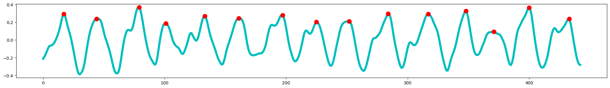

# Máté Unger
### About

Here you can find some hobby projects of mine, feel free to check  
them out in detail by following the appropriate links

## Pulse From Video

Measuring my pulse using a regular phone camera
  

  
[Read more](ppg.md)

## Posture Detection
Automatic suboptimal posture detection via webcam

  
[Read more](postureDetection.md)

## Evil Images
How to confuse (visual) neural networks
  
[Read more](adversarialImages.md)
