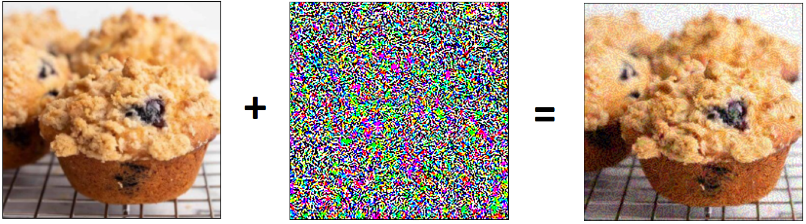
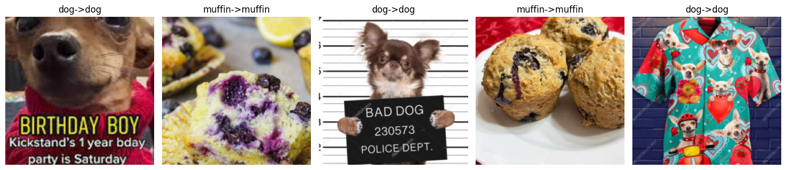
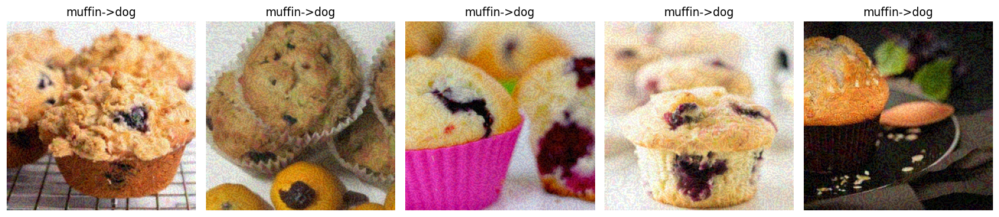
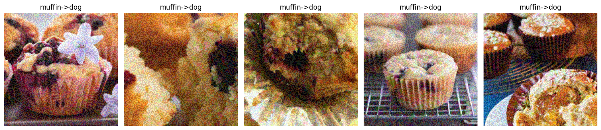
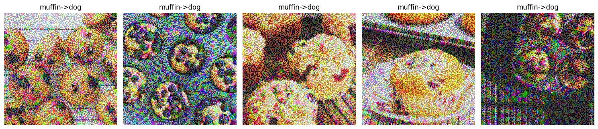

# Adversarial Images

## Intro

It feels like we are living in the future as AI (in some form) becomes part of more and more everyday events. People can't help but wonder where this might lead 
and how could things go wrong. This got me thinking: how can I make things go wrong? How wrong? 
 

Whith these questions in mind the goal of this project is to explore some of the vulnerabilities of neural networks used for visual image classification.

## Strategy

1. **Select model to attack**
   
     Find a model designed for a classification task.

3. **Set the model up, train it**

     Get a sense of how it would normally operate for later reference.

4. **Attack model**

     Create ways that mess with the model.

5. **Compare pre- and post-attack performance**

     Gauge the extent of the effectiveness of different mehtods.

### Model selection

   I opted to use a model that deals with visual classification problems (what object is on the image) because the input (image) alteration and output are easy to observe.
  
  I wanted to make sure that any change in performance of the model was due to my mischief and not just its limited capacity to learn, so I picked Resnet18, a relatively complex one. 

 

  It is 18 layers deep and has a few tricks up its sleeve such as non-linear data flow (data is fed forward at certain layers skipping a couple). Since these deep networks (lot of layers) come with a large number of parameters I opted not to train it from scratch but adapt a pretrained model for my purposes. 

### Training

   I wanted to try misleading the model in a binary classification problem (2 classes). I used transfer learning to create a custom head for the pretrained model and trained it to differentiate between chihuahuas and muffins on <a href="https://www.kaggle.com/datasets/samuelcortinhas/muffin-vs-chihuahua-image-classification">this dataset</a>

 

### Attack methods

   I was interested in non-targeted and targeted methods. In a classification setting non-targeted means the ouput should be anything but the correct output. In the targeted case we want the output to be a specific class defined by us. 

    

   1. **FGSM (Fast Gradient Sign Method)**

        In classification problem during trainig the model we optimize the model to fit the groups/classes in our data. In this attack we try to interfere with this principle by modifying the input image such that the true class will seem less probable than everything else.
       
      We can achieve this by adding noise to our input (image) in a specific way. First we make a prediciton with the original image, then adjust the image by addign noise and then making a second prediction to see if the model has misclassified the noisy image. The noise is calculated by the following formula:
       
      
      Xadv = Xoriginal +  ϵ * sign (∇X J(X,Ytrue))
       
      
      Where:
       
      
      X: input
      Xoriginal: adversarial input
      
      Ytrue: correct/true class
      
      ϵ: magnitude/strength of perturbation (added noise)
      
      (∇X J(X,Ytrue)): gradien of loss function used (for the input X)

      

      
      

      
   3. **One-step target class**

      We can wiev this attack as a modified FGSM where we do not minimize the likelyhood of the true class but maximize the likelyhood of an adversarial one. We go through the same steps as with FGSM but the formula for perturbation is slightly different:
       
      
      Xadv = Xoriginal -  ϵ * sign (∇X J(X,Ytrue))
       
      
      (Instead of addig noise, we substract it from the original input image)

In most cases attacks such as FGSM are intended to be hard to detect or undetectable by the human eye, so if in order for an image to be misclassified there is clearly visible perturbation the attack may not be considered succesfull.
      

### Comparison

The following series of images show how the model output changes due to the amount of perturbation (epsilon) added. The title of each image has the following structure: [original label] -> [label of modified image] 

Epsilon = 0 (control)

<em>Unmodified control images. Notice how the model is able to tell the last image also contains dogs.  </em>
   

Epsilon = 0.05

<em> With only a small amount of added perturbation the images look mostly normal, however in these cases the change was enough for the model to assigned incorrect labels.  </em>

Epsilon = 0.1

<em>With a bit more perturbatin the images look rather grainy, low quality. In some cases the modification is apparent. </em>

Epsilon = 0.3

<em>These are not fooling anyone (except the model), they are clearly modified</em>

