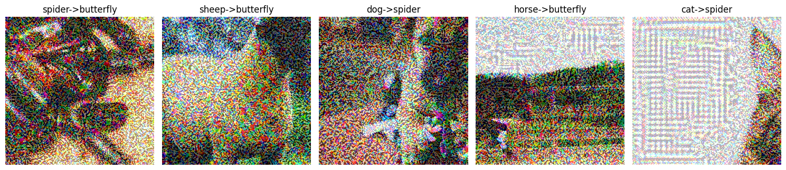

# Adversarial Images

## Intro

It feels like we are living in the future as AI (in some form) becomes a part of more and more everyday events. People can't help but wonder where this might lead and how things could go wrong. This got me thinking: how can I make things go wrong? How wrong?
 

Whith these questions in mind the goal of this project is to explore some of the vulnerabilities of neural networks used for visual image classification.

## Strategy

1. **Select model to attack**
   
     Find model designed for a image classification task.

3. **Set the model up, train it**

     Get a sense of how it would normally operate for later reference.

4. **Attack model**

     Create ways that mess with the model.

5. **Compare pre- and post-attack performance**

     Gauge the extent of the effectiveness of different mehtods.

## Model selection

   I opted to use a model that deals with visual classification problems (what object is on the image) because the input (image) alteration and output are easy to observe.
  
  I wanted to make sure that any change in performance of the model was due to my mischief and not just its limited capacity to learn, so I picked Resnet18, a relatively complex one. 

 

  It is 18 layers deep and has a few tricks up its sleeve such as non-linear data flow (data is fed forward at certain layers skipping a couple). Since these deep networks (lots of layers) come with a large number of parameters I opted not to train it from scratch but adapt a pretrained model for my purposes. 

## Training

   I wanted to try misleading the model in a binary classification problem (2 classes) and multiclass problem (>2 classes). I used transfer learning to create custom heads for the pretrained model. 

I worked with these models:

1. Resnet18 - binary classification
     Differentiates between Chihuahuas and muffins (in some cases it's harder than you'd think) based on <a href="https://www.kaggle.com/datasets/samuelcortinhas/muffin-vs-chihuahua-image-classification">this dataset</a> with around 97% accuracy.

2. Resnet18 - multiclass
      Can label images belonging to 10 classes of animals (horse, elephant, spider...) based on <a href="https://www.kaggle.com/datasets/alessiocorrado99/animals10">this dataset</a> with an accuracy of 90%.

 

## Attack methods

   I was interested in non-targeted and targeted methods. In a classification setting non-targeted means the output should be anything but the correct output. In the targeted case we want the output to be a specific class defined by us. 

    

   1. **FGSM (Fast Gradient Sign Method)**
         

        In classification problem during training the model we optimise the model to fit the groups/classes in our data. In this attack we try to interfere with this principle by modifying the input image such that the true class will seem less probable than everything else.
       
      We can achieve this by adding noise to our input (image) in a specific way. First we make a prediction with the original image, then adjust the image by adding noise and then making a second prediction to see if the model has misclassified the noisy image. 
         

      The noise is calculated by the following formula:
       

      Xadv = Xoriginal +  ϵ * sign (∇X J(X,Ytrue))
       
      
      Where:
       
      
      X: input
      Xoriginal: adversarial input
      
      Ytrue: correct/true class
      
      ϵ: magnitude/strength of perturbation (added noise)
      
      (∇X J(X,Ytrue)): gradien of loss function used (for the input X)

      

      
      

      
   3. **One-step target class**
      

      We can view this attack as a modified FGSM where we do not minimise the likelihood of the true class but maximise the likelihood of an adversarial one. We go through the same steps as with FGSM but the formula for perturbation is slightly different:
      

          
      
      Xadv = Xoriginal -  ϵ * sign (∇X J(X,Ytrue))
       
      
      (Instead of addig noise, we substract it from the original input image)

In most cases attacks such as FGSM are intended to be hard to detect or undetectable by the human eye, so if in order for an image to be misclassified there is clearly visible perturbation the attack may not be considered successful.

      

## Results

### Non-targeted

#### Resnet18 binary

The following series of images show how the model output changes due to the amount of perturbation (epsilon) added. The title of each image has the following structure: [original label] -> [label of modified image] 

Epsilon = 0 (control)

<em>Unmodified control images. Notice how the model is able to tell the last image also contains dogs.  </em>
   

Epsilon = 0.05

<em> With only a small amount of added perturbation the images look mostly normal, however in these cases the change was enough for the model to assign incorrect labels.  </em>

Epsilon = 0.1

<em>With a bit more perturbation the images look rather grainy, low quality. In some cases the modification is apparent. </em>

Epsilon = 0.3

<em>These are not fooling anyone (except the model), they are clearly modified</em>

Notice how in all of the above examples the attack only worked with a muffin image. Maybe these cookies are more dog-like than the dogs were muffin-like. Or perhaps a dog's facial features are more characteristic to its species than a muffin's general shape (model is less confident if something is a muffin originally).
 
The next image summarises the models accuracy in relation to the amount of added perturbation.

   

<em>Model accuracy for each amount of added perturbation</em>

The graph clearly shows the attack worked. Accuracy scores almost halved with larger epsilon values. It's interesting to see the accuracy scores plateau after epsilon reaches 0.15. This suggests that the amount of added perturbation is more than enough after this point and we can get away with far less for similar results. 

#### Resnet8 multiclass

Again, some images to illustrate the effects of perturbation.

Epsilon = 0

   

<em>Control group, model makes correct predictions</em>

Epsilon = 0.05

   

<em>In some cases it's hard to tell whether the image has been modified or not.</em>

Epsilon = 0.3

   

<em>Obvious signs of modification.</em>

   

<em>Model accuracy as a function of added perturbation</em>

   Again we can see a sharp drop in accuracy after 5% added perturbation. This time we have not managed to hit a plateau, however it would most certainly come with a further 5-10% added perturbation as we are nearing the 10% accuracy mark (which would be expected with random guesses). 

### Targeted

#### Resnet18 binary

   Since in the non-targeted case I only managed to get muffin -> dog misclassifications, here I set the target class to be muffins to see if I can force it the other way. Unfortunately I was not able to do so, again all mistakes were of the muffing -> dog type. 

Epsilon = 0

   

<em>Control group, model makes correct predictions</em>

Epsilon = 0.3

   

<em>Images with most amount of perturbation. Still all labeled dogs.</em>

   

<em>Similar curve as before. However since all observed misclassifications are muffin -> dog, it suggests after epsilon = 0.15 the model labels almost everything as a dog. Hence the drop in accuracy.</em>

#### Resnet18 multiclass

Epsilon = 0.05

   

<em>5% added perturbation targeting the "chicken" class</em>

Epsilon = 0.3

   

<em>30% added perturbation, also "chicken" target. Note that almost all misclassification by this point are falsely labelled as "butterfly". Even Though the target was missed, at least it seems somewhat consistent</em>

The accuracy-epsilon relationship is identical to the non-targeted case. 

I've also tried another targeted approach. In this one I used a dynamic target class selected by picking the least likely one from the model's initial prediction. While this seemed promising it did not deliver any better results than the previous method.  

### Conclusion

FGSM is a relatively simple and computationally inexpensive method. While it is not the most reliable one, it's definitely able to significantly drop model accuracies even with a small amount of perturbation. 
 
The targeted attack doesn't work exactly as I hoped however it seems effective as well but is not worth the extra hassle. Maybe a less covert method like adversary patches might work much better. 

