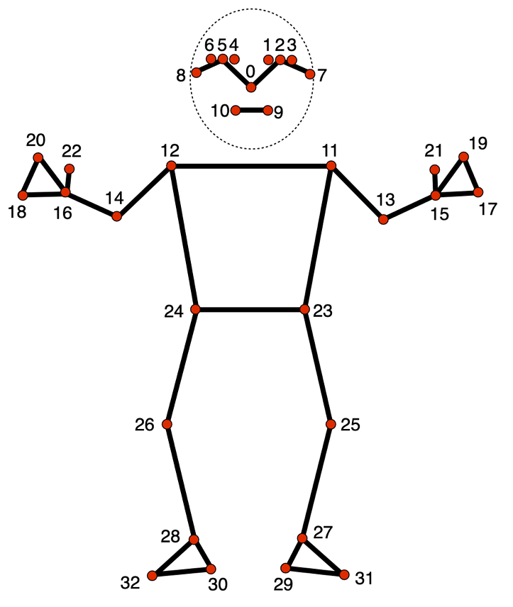
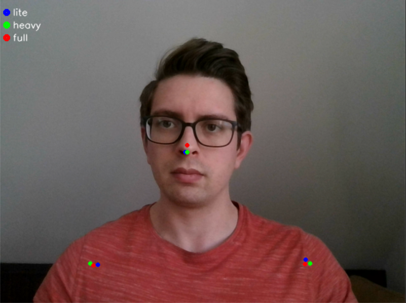
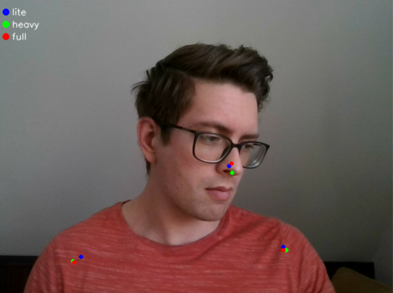
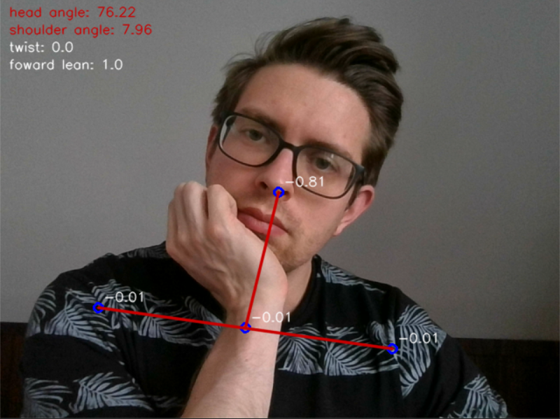
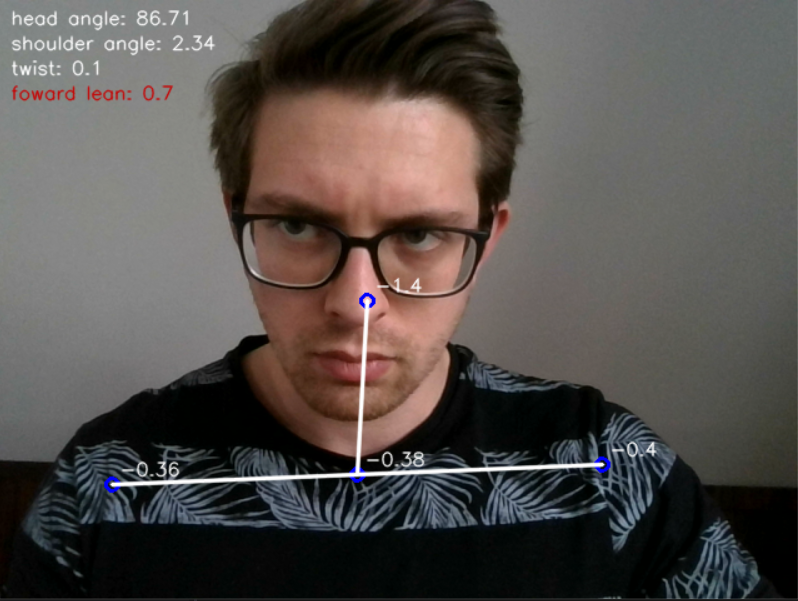

# Posture detection via webcam

## Intro
A lot of "office-jobs" require us to sit for prolonged periods of time, which can have adverse effects on several parts of the body due to poor sitting posture. 
I'm (among a heap of others) guilty of leaning in all possible directions while sitting putting strain on my back and neck. 
The goal of this project is to combat my bad habits and create an automated system that can alert me in case my posture becomes suboptimal.

## Strategy

1. **Find posture detection method**
   
     Find the most robust computer vision based method for detecting posture real time while sitting at a desk

3. **Process real time camera feed**

     Use posture detection modell on real time camera feed to detect leaning, twisted body posture

4. **Feedback**

     Create some way for the system to alert me when necessary


### Detection method

I've found a computer vision solution from Google called [Mediapipe](https://developers.google.com/mediapipe/solutions/guide). 
This is a whole suite of different solutions for various machine learning problems. In this project I used their pose landmark detection models. 
These models take an image or video stream as input and try to find various key points (coordinates within the image) with respect to given parameters. Key points are also called landmarks,
and refer to charactersitic body parst such as elbows, knees, shoulders etc. The following image shows the available landmarks.


*Available landmarks in mediapipe models along with their reference indices*

Since in my case I'll be sitting the camera will not be able to see most of my body. Fortunately these models are robust enought to produce an output (a number of landmarks) even with such input limitations. It would be nice to have additional information about the relative position of my lower body but it would also require me to sit really far from the camera which will not work with my integrated webcam. 

Given the constraints of my specific application I've decided to use the landmarks corresponding to the shoulders (11,12) and some on the face (0,7,8).
The position of the soulders should tell me if I'm leaning left/right (in-plane) or twisting (one shoulder is closer to camera). The landmarks on the head should 
allow for head posture characterisation such as left/right leaning, twisting and forward leaning. I should also mention that the models used not only return x,y coordinates for each landmark, but they also provide a z coordinate which represents the relative position of landmarks depth-wise. This will be especially useful for detecting leaning towards and away from the camera. 

The Mediapipe solution package offers multiple models (similar to MobileNetV2) for the same pose detection task. These are optimized for slightly different applications, which means a tradeoff between latency (due to processing time) and landmark accuracy and consistency. There are 3 models available: posture detector -lite, -heavy and -full. 
The lite model has the lowest latency but should also have a somewhat lower accuracy compared to the others. I tested all 3 to see which one would me the best. 

 

*landmarks of interest for the lite, heavy and full models*


Overall the best (most robust) seemed to be the heavy model since it could track facial landmarks the most accurately. Landmarks on the head proved to be less precise compared to those on the rest of the body, so I decided to not use landmark 7 and 8 and only kept the one on the nose (#0). The heavy model could keep track of the nose-landmark the best and it also seemed to be more consistent with the depth coordinates of the landmarks in general. There was a notivable increase in latency compared to the lite model, however this is an acceptable tradeoff since I usually tend to remain relatively still while sitting so the latency should not affect the results that much. 

### Processing camera feed

As previously mentioned I planned on using my integrated webcam for capturing video. Since Mediapipe utilizes openCV I could use CV2's videocapture module to access my camera and provide the model with the input. After loading the model and setting up detection parameters (number of bodies to detect, tracking landmarks..) using it is straight forward. It returns a custom mediapipe object containing metadata and data among which the landmark coordinates can be found. I found working with the data in the provided format was a bit bothersome, so I opted to create my own python class to handle it. This method also allowed my to keep the code cleaner and more human readable by packing my costom functions (depth calculation, drawing) within the class I created. I also created an extra landmark out of the 2 shoulder ones to aide the pose characterization process. 


*Blue circles for the landmarks used, white connecting lines, depth scores in white text next to landmarks, additional angles and ratios in top left corner*


Following these steps I was able to calculate several aspects of my posture namely:
1. angle of straight line drawn between shoulders relative to horizontal orientation -> leanin side to side (in-plane)
2. angle of straight line drawn between nose and shoulder midpoint relative to horizontal -> leaning my head and neck sideways
3. difference in depth between the shoulders -> twisting my whole upper body
4. difference in depth between nose and shoulder midpoint -> leaning forward

Once I had the angles and ratios calculated I was finally able to visualize them with some conditions. For example the color of a given line would change from white to red if some value associated with it would leave a certain acceptable range. To determine these ranges I just used trial and error method while trying to sit straight with good posture and doing the exact opposite. 




*Images demonstating what it looks like if I lean in either to the side or forward. Note the red text and lines indicating a certain value exceeding its optimal range*

### Feedback 

I consider the visual elements changing (shown in previous section) to be a sort of feedback. However this is probably not the best way to do it since I would not like to have an open window showing myself all the time. I also tried implementing a warining tone/sound in addition but playing the sound seems a bit more tricky than anticipated as accessing the speakers messes with the camera feed and program execution.


### Code

```python 
import time
import cv2
import mediapipe as mp
from mediapipe.tasks import python
from mediapipe.tasks.python import vision
import numpy as np
import math
from Util import Landmark, angle, line, depth_diff, createModel
import winsound
```

```python
model_path = './models/pose_landmarker_heavy.task'
model = createModel(model_path)
```

```python
cap = cv2.VideoCapture(0)
while cap.isOpened():
    # read frame
    _, frame = cap.read()
    # resize the frame for portrait video
    # frame = cv2.resize(frame, (350, 600))

    # convert to RGB then mp-format and flip frame along vetrial axis
    frame_rgb = cv2.flip(cv2.cvtColor(frame, cv2.COLOR_BGR2RGB), 1)
    mp_image = mp.Image(image_format=mp.ImageFormat.SRGB, data=frame_rgb)
    frame = cv2.flip(frame, 1)

    # process the frame for pose detection
    result = model.detect_for_video(mp_image, round(time.time() * 1000))

    # only proceed if there are landmarks detected
    if result.pose_landmarks != []:
        landmarks = result.pose_landmarks[0]

        # landmarks of interest
        head = Landmark.from_mp(landmarks[0], frame.shape)
        left_shoulder = Landmark.from_mp(landmarks[11], frame.shape)
        right_shoulder = Landmark.from_mp(landmarks[12], frame.shape)

        between_shoulders = Landmark(
            (left_shoulder.x + right_shoulder.x) / 2,
            (left_shoulder.y + right_shoulder.y) / 2,
            (left_shoulder.z + right_shoulder.z) / 2,
        )
```

```python
        # calculating relative angles between landmark connections
        head_angle = angle(head, between_shoulders)
        shoulder_angle = angle(left_shoulder, right_shoulder)

        # calculating relative difference in depths of landmark pairs
        side_twist = depth_diff(left_shoulder, right_shoulder)
        forward_lean = depth_diff(head, between_shoulders)

```

```python
        head_line_color = (255, 255, 255)
        shoulder_line_color = (255, 255, 255)
        forward_lean_color = (255, 255, 255)
        side_twist_color = (255, 255, 255)

        # angle of head-soulder midpoint line compared to horizontal
        if head_angle < 80:
            head_line_color = (0, 0, 200)

        # angle of line drawn between shoulders compared to horizontal 
        if shoulder_angle > 3:
            shoulder_line_color = (0, 0, 200)

        # depth difference between the shoulders
        if side_twist > 0.45:
            side_twist_color = (0, 0, 200)

        # depth difference between head and shoulder midpoint
        if forward_lean < 0.8:
            forward_lean_color = (0, 0, 200)

```

```python
        # draw landmarks and connecting lines on image
        frame = head.draw(frame)
        frame = left_shoulder.draw(frame)
        frame = right_shoulder.draw(frame)
        frame = between_shoulders.draw(frame)

        frame = line(frame, head, between_shoulders, color=head_line_color)
        frame = line(frame, left_shoulder, right_shoulder, color=shoulder_line_color)

        # text style
        font = cv2.FONT_HERSHEY_SIMPLEX
        color = (255, 255, 255)
        line_type = cv2.LINE_AA

        # drawing text for landmarks
        frame = head.show_attr(frame, head.z)
        frame = left_shoulder.show_attr(frame, left_shoulder.z)
        frame = right_shoulder.show_attr(frame, right_shoulder.z)
        frame = between_shoulders.show_attr(frame, between_shoulders.z)

        # drawing text for angles in top left corner
        frame = cv2.putText(frame, f"head angle: {head_angle}" , (10,20), font , 0.5, head_line_color, 1, line_type) 
        frame = cv2.putText(frame, f"shoulder angle: {shoulder_angle}" , (10,40), font , 0.5, shoulder_line_color, 1, line_type)
        frame = cv2.putText(frame, f"twist: {side_twist}" , (10,60), font , 0.5, side_twist_color, 1, line_type)
        frame = cv2.putText(frame, f"foward lean: {forward_lean}" , (10,80), font , 0.5, forward_lean_color, 1, line_type)


    # display the frame
    cv2.imshow("Output", frame)

    # esc button press
    if cv2.waitKey(5) & 0xFF == 27:
        break

cap.release()
cv2.destroyAllWindows()
```

