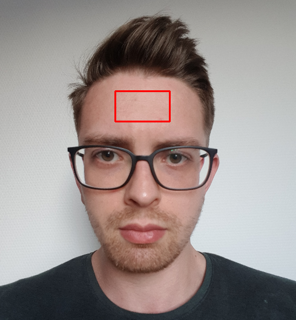
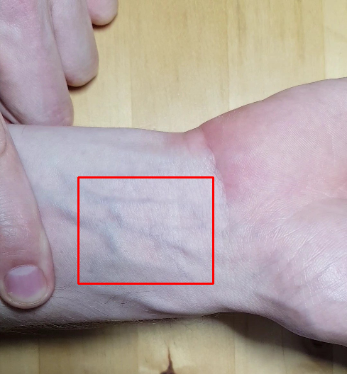
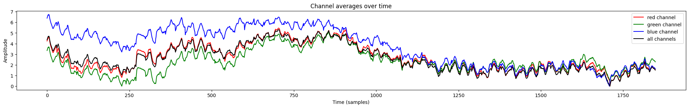
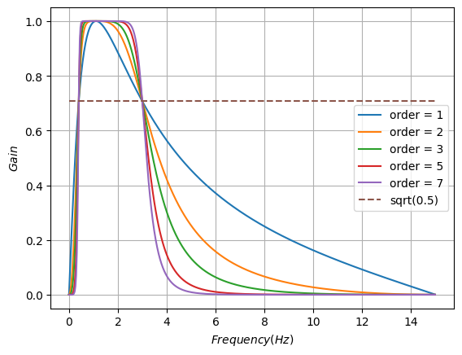
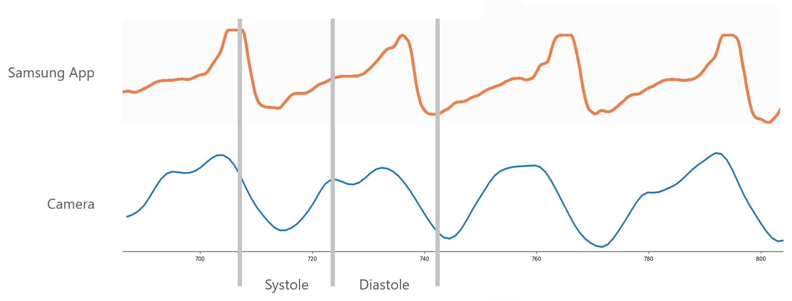
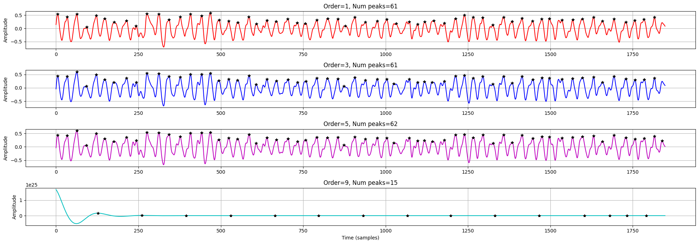
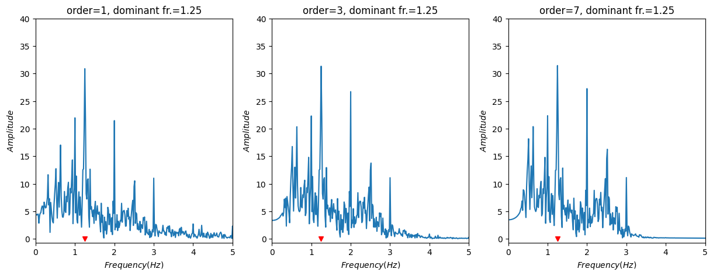

# PPG at a distance

## Intro
Photoplethysmography (PPG) is a measurement technique used to observe volumetric changes in peripheral blood vessels. Usual measurement setups operate by having LEDs in close proximity to skin (finger) and measuring either the transmitted or refracted light.

I've heard the same measurement is possible at a distance using a regular phone camera. The goal of this project is to verify this claim.

## Strategy

1. **Gather data**
    1. Stationary body part (back of hand, wrist, face) with natural light
    2. Stationary body part with artificial light

2. **Preprocessing**

     Stabilize video (optional), extract metadata (lenght, fps ...) and crop frames of video 

4. **Analysis**

   Look at difference between adjacent frames, apply filters, search for local maxima, examine periodicity

## Gathering data

    Since the final result of such a measurement represents the number of heartbeats over a minute (Beats Per Minute, BPM) it seemed beneficial to start with approximately 1 minute long videos. This also minimises the error coming from extrapolating results from a short video. 

I recorded my hand, wrist and face for around 1 minute each in natural and artificial light (non-flickering LEDs to avoid 60 Hz artefact). I tried to minimise movement by fixing the phone and/or bodypart’s position. I used the main camera of a Samsung Galaxy S8 (1920x1080, 30 fps). Simultaneously measured my pulse by the old reliable finger-on-wrist method.

 

  
   

 

    <em>Frame of facial (left) and wrist-videos (right) with the region of interests highlighted with red rectangles. 
</em>

## Preprocessing

    First I read the metadata of the video to obtain precise info about the framerate, dimensions, number of frames.
Then I cropped each frame in the video to only contain the region of interest. This was usually relatively homogeneous (colour wise) so darker/lighter parts drifting in and out of the crop wouldn't throw off the calculations (in case of minor movements).

I separated the red, green and blue colour channels of the cropped images while keeping the original one. This allowed for separate examination to see if any of the channels contained more information or seemed less noisy. I checked the signals’ waveforms visually and also calculated the signal-to-noise ratio (SNR) for each of the 4 versions. Then performed the rest of the processing only on the most promising ones. 

    

<em>Color channels over time (in samples, here there are 1849) extracted from a face video. Large fluctuations are probably due to movement and/or lighting condition changes.</em>

| Channel     |      SNR    |
| ----------- | ----------- |
| Red         |    41.12    |
| Green       |    42.64    |
| Blue        |    41.88    |
| All         |    42.63    |

<em> Signal-to-noise ratio for the used color channels. "All" refers to the non-separated case.</em>

Based on the above table I carried out the analytic steps on the green channel and all channels combined as their SNR is the highest and  almost identical.

## Analysis

I tried several different methods to clean the signals up a bit. In the end a Butterworth filter (bandpass) worked the best. I set the lower cutoff frequency to 0.6 Hz (equivalent to 36 BPM, severe bradycardia) and the higher cutoff to a generous 3 Hz (180 BPM). 

 

    

<em> Frequency response of Butterworth filters with different orders. The higher the order tha sharper the cutoff. </em>

 

I also compared my signals with ones obtained with a built-in PPG sensor in my phone (Samsung Galaxy S8). The recordings were not concurrent but the waveforms look really similar and exhibit the <a href="https://www.researchgate.net/publication/335023100_Non-invasive_evaluation_of_coronary_heart_disease_in_patients_with_chronic_kidney_disease_using_photoplethysmography">characteristics</a> of reflected PPG measurements. 

 

   

<em>Filtered waveforms obtained via phone built-in PPG sensor and camera.</em>

 

    
After smoothing the signals with this filter, the next step was to detect the peaks corresponding to heartbeats.
First I tried using numpy’s find_peaks method which aims to find all peaks fitting given criteria. I set the peak-to-peak distance (fs/high cutoff) and peak prominences (how much each peak protrudes out of its environment). With these 2 parameters I was able to identify almost all peaks relatively reliably (given clean enough input). For more noisy signals where the peak detection was less reliable I also tried estimating it by looking at the mean, modus and median of the peak-to-peak distances. While these were effective in some cases, overall they seemed too simple to be reliable. 

    

<em> Signal (all channels combined) filtered with Butterworth filters with different orders. After about the 5th order there were no useful changes (order = 9 is completely distorted). The graph also shows the detected peaks with black asterisks. Notice how the last peak is only detected in just one case.</em>

 

Another approach not reliant on counting peaks is to analyse the signal in the frequency domain. I opted for a Fast Fourier Transform (FFT) which decomposes the given signal into the sum of periodic functions with different frequencies. This method allows us to observe how much a frequency component contributes to building the original signal.  

 

    

<em>Frequency domain representations of a signal (video of wrist, 76 BPM) filtered with different orders. Notice how the most dominant frequency component (highest peak) is the same in all 3 cases.</em>

 

The graphs above show that the frequency domain representation can be quite effective in determining the heart rate from a video. In this case the most dominant frequency component is clearly 1.25 Hz which would mean 75 BPM. That is only 1 off from the actual number of heartbeats for this given recording. I’ve had similarly accurate estimations for different videos, so it seems this is a rather reliable way of obtaining the heart rate.

## Conclusions

I’ve found that it is indeed possible without any special tools to measure one's heart rate just by taking a video of a body part. I’ve also managed to get pretty accurate results using both time domain (peak finding) and frequency domain (FFT) analysis. 

 
While some of my results are accurate I’ve had to carefully produce the videos to have favourable lighting conditions. Also the obtained signals are quite noisy as the sensor (camera) is quite far away from the subject (skin) compared to traditional PPG measurement setups.

